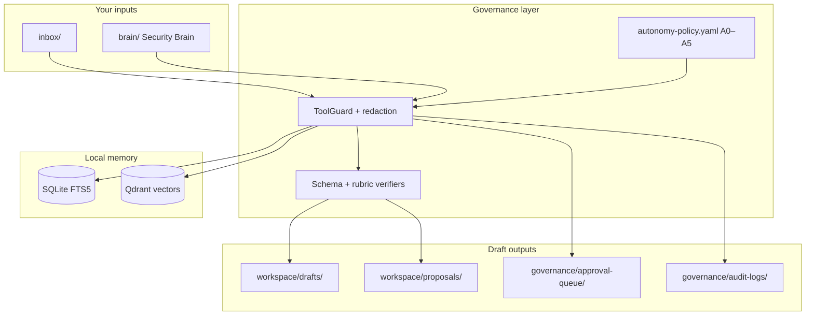

<div align="center">

# Personal GRC Agent

**Your local-first copilot for security & compliance work.**

Turn meeting notes, policy changes, audit artifacts, and cloud findings into verified drafts —  
without auto-publishing anything to external systems.

<br />

[](LICENSE)
[](pyproject.toml)
[](agent/charter.md)
[](agent/autonomy-policy.yaml)

<br />

[Quick Start](#-quick-start) · [Getting Started Guide](docs/getting-started.md) · [Use Cases](#-use-cases) · [Features](#-features) · [Skills](#-skills)

</div>

---

## What is Personal GRC Agent?

**Personal GRC Agent (PGA)** is a portable, Git-backed security and compliance assistant you run on your own machine. It combines a **Security Brain** (your policies, frameworks, controls, and evidence) with **verifier-gated drafting skills** that produce audit-ready artifacts — meeting summaries, ticket proposals, policy redlines, control crosswalks, evidence indexes, risk assessments, and more.

Everything stays **local-first**: memory lives in SQLite and Qdrant on your workstation, embeddings run locally, and a hash-chained audit log records every governed action. The agent reads and drafts autonomously, but assigning work to people, publishing policies, or writing to external GRC and ticket systems requires explicit human approval.

> **PGA** = the product · **`spa`** = the CLI (`pip install -e .` → `spa` on your PATH)

---

## ✨ At a glance

| | |
|---|---|
| 🧠 **Security Brain** | Git-backed knowledge base — frameworks, policies, controls, evidence |
| ⚡ **Verifier-gated skills** | Nine drafting skills with schema + rubric checks before any write |
| 🔒 **Local-first memory** | SQLite episodic + Qdrant semantic search — your data stays on your machine |
| 🛡️ **Governance-as-code** | Every action classified A0–A5; high-risk operations need human approval |
| 📜 **Hash-chained audit trail** | Tamper-evident JSONL logs with CLI verify and auditor export |
| 🔌 **MCP-native** | Same governed pipeline from CLI, Cursor, Claude Code, Hermes, or any MCP client |

---

## 🎯 Use cases

PGA is built for the recurring work of security and compliance teams — the drafts that eat hours but should never auto-publish without review.

### Meeting follow-through

Drop steering-committee or audit-prep notes into `inbox/` and run `spa ingest`. PGA redacts sensitive content, indexes it into memory, and when meeting signals are detected automatically:

- Synthesizes **decisions, risks, and action items**
- Creates **AI-Proposed ticket JSON** with control tags (`SOC2:CC6.1`, `CSF:PR.IP-12`, etc.)
- Triggers **policy redlines** when action items mention MFA, access control, or policy updates

**Example:** A quarterly risk committee produces three remediation tickets and a draft access-control policy update — all tagged and ready for human review, nothing assigned or published automatically.

### SOC 2, ISO 27001, and framework crosswalks

Map vendor questionnaires, internal policies, or customer security addenda to multiple frameworks in one pass.

```bash
spa run-skill csf-crosswalk --input vendor-artifact.md
```

Output includes mappings across **NIST CSF 2.0**, **SOC 2**, **ISO 27001**, **ISO 27018**, **ISO 42001**, and **NIST SP 800-53**, plus a gap list for controls not covered by your artifact.

**Example:** A customer sends a 40-page security appendix. PGA maps each section to your control catalog and highlights gaps before you respond to the deal desk.

### Audit evidence collection

Generate structured evidence indexes for a control and audit period, optionally enriched with read-only cloud checks.

```bash
spa run-skill evidence-pack --input control-period.md --output-dir .
spa cloud scan --provider aws --period 2026-Q2
```

**Example:** For SOC 2 CC6.1 during Q2, PGA produces an evidence index under `brain/evidence/` listing what exists, what's missing, and links to cloud findings — ready for your auditor walkthrough.

### Policy change management

Turn a change request into a redlined Markdown proposal and draft PR body on an agent branch.

```bash
spa run-skill policy-redline --input change-request.md
```

**Example:** Legal asks for MFA language in the access-control policy. PGA drafts the redline with control mappings; you review and promote to `brain/03-policies/proposals/` before any publish (which requires CPO approval).

### Control gaps and remediation tickets

Describe a finding or gap; get a structured ticket proposal with suggested owner, rationale, and control tags.

```bash
spa run-skill ticket-draft --input gap-description.md
```

Tickets are created as **AI-Proposed** files with `assignee: unassigned`. Assigning a human or raising priority requires an approved Change Proposal Object (CPO).

### Vendor security questionnaires (CAIQ / SIG)

Draft answers grounded in your Security Brain, with citations and confidence scores.

```bash
spa run-skill questionnaire --input sig-questions.md
```

Unsupported questions are flagged `needs_human: true` — PGA never fabricates citations.

**Example:** A SIG Lite lands in your inbox Friday afternoon. PGA drafts cited responses from your policies and flags the five questions that need a human touch before submission.

### Third-party and product risk assessment

Assess a SaaS vendor, integration, or internal product with NIST SP 800-30 methodology, FAIR-aligned scoring, and a STRIDE threat model.

```bash
spa run-skill risk-analyst --input vendor-assessment.md
```

**Example:** Evaluating a new AI vendor produces a risk register, threat model, and implementation plan — all draft artifacts in `workspace/proposals/risks/`.

### Open-source and internal repo review

Run an OWASP/ASVS-oriented security review against a local path or Git URL.

```bash
spa run-skill repo-security-review --input repo-target.md
```

**Example:** Before adopting an internal tool, PGA scans the repo and returns risk-scored findings with ATT&CK mapping for your security review queue.

### Daily program triage

Synthesize open proposals, pending approvals, and recent activity into a morning brief.

```bash
spa run-skill daily-brief --input context.md
```

**Example:** Start Monday with a one-page view of what needs your approval, what's blocked on CPOs, and what landed in the inbox over the weekend.

### AI governance and emerging frameworks

Install optional brain packs for AI-specific standards without rebuilding your knowledge base from scratch.

```bash
spa brain list
spa brain add iso-42001
spa brain add nist-ai-rmf
```

**Example:** Your org is adopting ISO 42001. Install the pack, seed memory, and crosswalk existing policies against AI governance controls.

### Conversational access via MCP

Connect Cursor, Claude Code, Hermes, or any MCP client to the same governed pipeline — ingest, skills, proposals, audit verify, and memory search — with human confirmation required for approvals.

**Example:** Ask your IDE assistant to "ingest yesterday's audit prep notes and draft tickets" — it runs through ToolGuard, verifiers, and the audit chain, not ad-hoc file writes.

---

## 🚀 Quick start

```bash
git clone https://github.com/wcbot0/Personal-GRC-Agent.git
cd Personal-GRC-Agent
./bootstrap.sh
source .venv/bin/activate
make selftest
```

Try your first workflow:

```bash
cp evals/fixtures/meeting_sample.md inbox/my-first-meeting.md
spa ingest inbox/my-first-meeting.md
spa audit verify
```

Step-by-step setup, skill reference, MCP wiring, and troubleshooting: **[Getting Started Guide](docs/getting-started.md)**

<details>
<summary><strong>macOS write-access check</strong> (if bootstrap fails with <code>Operation not permitted</code>)</summary>

```bash
echo test > governance/audit-logs/_t.tmp && rm governance/audit-logs/_t.tmp
```

Grant **Full Disk Access** to your terminal and IDE, then clear quarantine on fresh clones:

```bash
xattr -dr com.apple.quarantine .
```

</details>

<details>
<summary><strong>CLI-only setup</strong> (skip optional chat-runtime prompts)</summary>

```bash
HERMES_BOOTSTRAP=0 ./bootstrap.sh
```

</details>

---

## 🧩 Features

### Draft-by-default, approve-to-publish

PGA reads your Security Brain, ingests notes, and writes local drafts without asking permission. Actions that create obligations for other people or authoritative records in external systems are gated behind **Change Proposal Objects (CPOs)** that block until a human approves.

| Autonomous (no approval) | Requires CPO approval |
|--------------------------|----------------------|
| Read brain, inbox, workspace | Assign ticket to a human |
| Ingest and index memory | Raise ticket priority above High |
| Write local drafts and proposals | Merge PR, publish policy |
| Create AI-Proposed unassigned tickets | Write to GRC or ticket systems |
| Search episodic + semantic memory | Terminal ticket state changes |

### Enforcement, not convention

All writes route through **ToolGuard** and **guarded_write()**. Verifier failures block artifact output. Unknown tools default to **A5 (blocked)**. You cannot bypass governance by hand-writing skill artifacts when audit matters — run `spa` instead.

### Redaction-at-write

Secrets and PII are stripped before persistence via `governance/redaction-rules.yaml`. Ingest passes redacted content to downstream skills, so meeting transcripts and vendor docs never land in memory unfiltered.

### Local-first memory

| Layer | Technology | Purpose |
|-------|------------|---------|
| **Episodic** | SQLite + FTS5 | Keyword search over ingested documents and sessions |
| **Semantic** | Qdrant + local embeddings | Vector search over your Security Brain |
| **Procedural** | `skills/` (git) | Versioned skill definitions, schemas, and verifiers |
| **Audit** | Hash-chained JSONL | Immutable, verifiable log of every governed action |

Embeddings run locally via `sentence-transformers` — no external embedding API calls.

### Runtime-swappable

Use PGA from the terminal, or connect any MCP-compatible AI assistant. The same skills, brain, and governance apply everywhere. Per-runtime setup: [`docs/runtimes/`](docs/runtimes/).

---

## 🛠 Skills

Nine verifier-gated skills. Each validates output against JSON schema and a success rubric before writing artifacts.

| Skill | What it produces | Typical trigger |
|-------|------------------|-----------------|
| **meeting-synth** | Decisions, risks, action items, ticket proposals | Meeting notes or transcript |
| **ticket-draft** | AI-Proposed ticket JSON with control tags | Control gap or remediation request |
| **policy-redline** | Redline Markdown + draft PR body | Policy change request |
| **csf-crosswalk** | Multi-framework control mapping + gaps | Vendor artifact or policy excerpt |
| **evidence-pack** | Evidence index for a control + period | Audit prep, SOC 2 walkthrough |
| **daily-brief** | Program status and triage summary | Morning standup, weekly review |
| **risk-analyst** | Risk register, threat model, implementation plan | Vendor/product assessment |
| **repo-security-review** | OWASP/ASVS findings with risk scores | Pre-adoption code review |
| **questionnaire** | CAIQ/SIG answers with brain citations | Incoming security questionnaire |

**Fastest path:** drop raw notes in `inbox/`, then `spa ingest inbox/<file>.md` — auto-detects meetings and chains downstream skills when signals match.

```bash
spa run-skill <skill-name> --input <file> [--output-dir <dir>]
```

Skill contracts and output schemas: [`skills/`](skills/)

---

## 🏗 How it works



```
Input → Redaction → Policy check (A0–A5) → Guarded execution → Skill → Verification → Audit → Human review
```

### Action-risk model

| Class | Label | Approval | Examples |
|:-----:|-------|----------|----------|
| **A0** | read | none | Read brain, ingest, search memory |
| **A1** | local_draft | none | Workspace drafts, git branches |
| **A2** | external_draft | notify | AI-Proposed tickets, draft PR bodies |
| **A3** | human_workflow | **CPO** | Assign human, raise priority |
| **A4** | authoritative_record | **CPO** | Merge PR, publish policy, GRC write |
| **A5** | high_risk | **blocked** | Delete audit logs, unknown tools |

Full policy: [`agent/autonomy-policy.yaml`](agent/autonomy-policy.yaml)

---

## 👥 Who is it for?

| Role | How PGA helps |
|------|---------------|
| **Staff Security / GRC engineer** | Meeting follow-through, control-tagged tickets, evidence packs, crosswalks |
| **Compliance lead** | Audit prep, framework mapping, policy redlines, questionnaire drafts |
| **Security program manager** | Daily briefs, CPO triage, open proposal tracking |
| **AppSec / product security** | Repo security reviews, third-party risk assessments |
| **Teams adopting AI governance** | ISO 42001 and NIST AI RMF brain packs, AI control crosswalks |
| **Consultants and fractional CISOs** | Portable Security Brain per client, auditable draft workflow |

---

## 🔐 Privacy and forking

PGA is designed to stay **local-first**. The public repository ships templates, eval fixtures, and governance code — not your organization's live compliance program.

| Do in a **private fork** | Never commit to a **public** repo |
|--------------------------|-------------------------------------|
| Authoritative policies (`brain/03-policies/*.md`) | `.env` or API keys |
| Real meeting notes and inbox content | `workspace/.data/`, `governance/audit-logs/`, `governance/approval-queue/` |
| Client- or company-specific brain content | `governance/.cpo-signing-key` |

- **Sample brain content** in this repo is illustrative — replace with your policies and evidence.
- **Test fixtures** under `evals/fixtures/` and `tests/` may contain synthetic secrets or intentional vulnerabilities; see [SECURITY.md](SECURITY.md).
- **Cursor / IDE config** — run `spa init --runtime cursor` locally; `.cursor/` is not committed.
- Cloned before June 2026 history rewrite? Re-clone or `git fetch origin && git reset --hard origin/main`.

Full scope: [SECURITY.md](SECURITY.md) (vulnerability reporting, safe defaults, third-party installers).

---

## 📚 Documentation

| Guide | Audience |
|-------|----------|
| **[Getting Started](docs/getting-started.md)** | Install, first workflow, skills, brain, MCP, troubleshooting |
| **[Contributing](CONTRIBUTING.md)** | Development setup, quality gates, PR guidelines |
| **[Security](SECURITY.md)** | Vulnerability reporting, safe defaults, test fixtures |
| **[Architecture](docs/SPA_MVP.md)** | Design goals, requirements, and component layout |
| **[AGENTS.md](AGENTS.md)** | AI assistant navigation — paths, skill routing, governance rules |
| **[Runtime setup](docs/runtimes/)** | Cursor, Claude Code, Hermes, ChatGPT, OpenClaw |
| **[Agent charter](agent/charter.md)** | Draft-by-default persona and principles |
| **[Autonomy policy](agent/autonomy-policy.yaml)** | Action-risk gates (A0–A5) |
| **[Skills](skills/)** | Per-skill contracts and output schemas |

---

<div align="center">

<br />

**Clone → bootstrap → ingest.** MIT-licensed — fork it, populate your Security Brain, and keep humans in the loop.

<br />

[](LICENSE)
[](docs/getting-started.md)
[](CONTRIBUTING.md)
[](SECURITY.md)
[](AGENTS.md)

</div>
