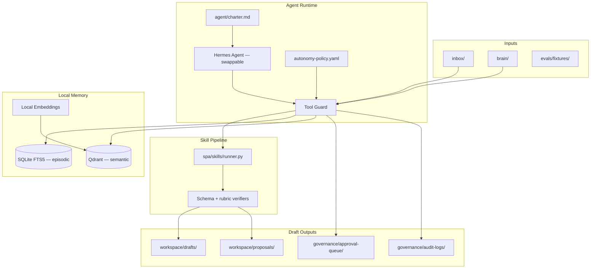

# Security Personal Assistant (SPA)

[](LICENSE)

A **local-first**, **draft-by-default** agentic assistant for security and GRC engineers. SPA helps you turn meeting notes, policy changes, and compliance artifacts into structured drafts — decisions, ticket proposals, control mappings, evidence indexes — without auto-publishing anything to external systems.

Clone → bootstrap → run. MIT-licensed public template; fork into a private org repo for your Security Brain content and credentials.

---

## Table of contents

- [What is SPA?](#what-is-spa)
- [Who is it for?](#who-is-it-for)
- [Core principles](#core-principles)
- [How it works](#how-it-works)
- [Setup guide](#setup-guide)
- [Configuration](#configuration)
- [Skills and use cases](#skills-and-use-cases)
- [Common workflows](#common-workflows)
- [Governance and approvals](#governance-and-approvals)
- [Repository layout](#repository-layout)
- [Development and testing](#development-and-testing)
- [Forking for your organization](#forking-for-your-organization)
- [CI and quality gates](#ci-and-quality-gates)
- [License](#license)

---

## What is SPA?

SPA (Security Personal Assistant) is a portable GRC copilot that runs on your workstation. It combines:

- A **Security Brain** — git-backed Markdown/YAML knowledge base (`brain/`) for frameworks, policies, controls, and evidence
- **Drafting skills** — versioned, verifier-gated workflows for meeting synthesis, ticket drafting, policy redlines, control crosswalks, and more
- **Local memory** — SQLite episodic store + Qdrant semantic search with local embeddings (no cloud memory)
- **Governance-as-code** — every tool call is classified A0–A5; high-risk actions require human approval via Change Proposal Objects (CPOs)
- **Full audit trail** — append-only JSONL logs for reconstructability

In MVP mode, SPA is **file-only**: it produces local drafts and AI-Proposed ticket JSON files. Connectors for Linear, Jira, Vanta, Drata, and Secureframe ship as disabled stubs — enable them post-MVP when you're ready for live integrations.

---

## Who is it for?

| Role | Typical use |
|------|-------------|
| **Staff Security / GRC engineer** | Turn steering meetings into tracked action items and control-tagged tickets |
| **Compliance lead** | Draft evidence packs, crosswalk controls across frameworks, redline policies |
| **Security program manager** | Daily briefs on pending approvals, open proposals, and recent activity |
| **Engineering teams adopting SPA** | Fork the template, populate `brain/`, wire connectors, enforce governance in CI |

---

## Core principles

| Principle | What it means |
|-----------|---------------|
| **Draft-by-default, approve-to-publish** | Reads and local drafts are autonomous. Assigning work to humans, publishing policies, or writing to GRC/ticket systems requires an approved CPO. |
| **Governance-as-code** | `agent/autonomy-policy.yaml` is the single source of truth for action-risk gates. |
| **Local-first memory** | Episodic (SQLite), semantic (Qdrant), procedural (skills), and audit (JSONL) stay on-box. |
| **Redaction-at-write** | Secrets and PII are stripped before anything is persisted (`governance/redaction-rules.yaml`). |
| **Auditable** | Every action emits a JSONL audit event with run ID, risk class, context, and outputs. |
| **Runtime-swappable** | Default agent runtime is Hermes (MCP-compliant). Swap via config without changing skills or brain content. |

---

## How it works

### High-level architecture



### Request lifecycle

1. **Input** — A file lands in `inbox/`, is passed to a skill, or is ingested from `brain/`.
2. **Redaction** — Content is scanned for secrets/PII before persistence.
3. **Policy check** — `ToolGuard` classifies the action (A0–A5) against `autonomy-policy.yaml`.
4. **Skill execution** — The skill produces structured JSON output and optional file artifacts.
5. **Verification** — Schema validation, rubric checks, and secret scans run. Failures trigger one retry; a second failure escalates to the approval queue.
6. **Audit** — Every step writes to `governance/audit-logs/*.jsonl`.
7. **Review** — You review drafts locally. A3+ actions wait for CPO approval before execution.

### Memory model

| Layer | Technology | Purpose |
|-------|------------|---------|
| **Episodic** | SQLite with FTS5 | Raw ingested documents, searchable by keyword |
| **Semantic** | Qdrant + local embeddings | Vector search over `brain/` and ingested content |
| **Procedural** | `skills/` directory | Versioned skill definitions, schemas, and verifiers |
| **Audit** | JSONL files | Immutable action log for compliance and debugging |

Bootstrap seeds all Markdown/YAML files under `brain/` into semantic memory. Use `make ingest` or `spa ingest` to add new content from `inbox/`.

### Action-risk model

| Class | Label | Approval | MVP examples |
|-------|-------|----------|--------------|
| **A0** | read | none | read inbox, search memory, ingest files |
| **A1** | local_draft | none | write local Markdown, create git branch, workspace drafts |
| **A2** | external_draft | notify | draft PR body files, AI-Proposed ticket JSON |
| **A3** | human_workflow | **CPO required** | assign human, raise priority, terminal ticket state |
| **A4** | authoritative_record | **CPO required** | merge PR, publish policy, GRC write |
| **A5** | high_risk | **blocked** | prod IAM changes, delete audit logs, risk acceptance |

A3+ actions create a Change Proposal Object in `governance/approval-queue/` and block until you approve them via the CLI.

---

## Setup guide

### Prerequisites

| Requirement | Version / notes |
|-------------|-----------------|
| **Python** | 3.11+ |
| **Docker Desktop** | For Qdrant (vector DB) and local embedding model |
| **Git** | Required for bootstrap and policy-redline branches |
| **macOS / Linux** | Tested on macOS; Linux should work with standard Docker setup |

Optional:
- **Hermes Agent** — default MCP runtime (`hermes` CLI); skills also run standalone via `spa`
- **LLM API key** — for full Hermes agent sessions (OpenAI-compatible or Anthropic)

### 1. Clone the repository

Use a plain, writable path. Avoid iCloud-synced folders (Desktop, Documents) on macOS.

```bash
git clone <your-fork-url> personal-grc-agent
cd personal-grc-agent
```

If you rename or move the repo after cloning, re-run `./bootstrap.sh` — it detects stale virtualenv paths and recreates them automatically.

### 2. Verify write access (macOS)

SPA writes runtime state to `governance/audit-logs/` and `workspace/.data/`. macOS **Transparency, Consent, and Control (TCC)** can block writes even when Unix permissions look correct.

```bash
echo test > governance/audit-logs/_t.tmp && rm governance/audit-logs/_t.tmp
```

If you see `Operation not permitted`:

1. Grant **Full Disk Access** to your terminal app and Cursor (System Settings → Privacy & Security → Full Disk Access), then restart both.
2. Clear the quarantine flag on a freshly downloaded clone:
   ```bash
   xattr -dr com.apple.quarantine .
   ```

### 3. Bootstrap

```bash
./bootstrap.sh
```

Bootstrap is **idempotent** and performs:

1. Creates/recreates `.venv` if missing or relocated
2. Installs the `spa` CLI (`pip install -e .`)
3. Copies `.env.example` → `.env` if missing
4. Starts Docker services (Qdrant on `:6333`, embeddings on `:8080`) — skips with a warning if Docker isn't running
5. Seeds `brain/` into Qdrant vector memory
6. Runs health checks (`make selftest`)

If Docker wasn't running during bootstrap, start it later and seed manually:

```bash
docker compose up -d
make seed
```

### 4. Verify installation

```bash
make selftest          # 6/6 tests should pass
spa --help             # CLI is available
spa proposals list     # approval queue (may be empty)
```

### 5. Configure environment (optional)

Edit `.env` for LLM and connector settings:

```bash
cp .env.example .env   # if bootstrap didn't already
```

See [Configuration](#configuration) below for all variables.

### Troubleshooting bootstrap

| Symptom | Fix |
|---------|-----|
| `pip: command not found` after `source .venv/bin/activate` | Repo was moved/renamed. Run `./bootstrap.sh` — it recreates the venv. Or: `rm -rf .venv && ./bootstrap.sh` |
| Docker daemon not running | Start Docker Desktop, then: `docker compose up -d && make seed` |
| Qdrant seed warnings | Wait for containers to be healthy (`docker compose ps`), then `make seed` |
| `Operation not permitted` on macOS | See write-access verification above |

---

## Configuration

All runtime settings live in `.env` (never commit this file):

| Variable | Default | Purpose |
|----------|---------|---------|
| `SPA_RUNTIME` | `hermes` | Agent runtime identifier |
| `LLM_PROVIDER` | `openai` | LLM backend for Hermes sessions |
| `LLM_API_BASE` | `https://api.openai.com/v1` | OpenAI-compatible API endpoint |
| `LLM_API_KEY` | _(empty)_ | Your LLM API key |
| `LLM_MODEL` | `gpt-4o-mini` | Model for agent sessions |
| `EMBEDDING_API_BASE` | `http://localhost:8080` | Local embedding service |
| `QDRANT_HOST` | `localhost` | Qdrant vector DB host |
| `QDRANT_PORT` | `6333` | Qdrant port |
| `TICKET_PROVIDER` | `none` | `none`, `linear`, or `jira` |
| `GRC_PROVIDER` | `none` | `none`, `vanta`, `drata`, or `secureframe` |
| `NOTES_PROVIDER` | `filesystem` | Local file-based notes |

Agent behavior is further defined in:

- `agent/charter.md` — persona, principles, draft surfaces
- `agent/autonomy-policy.yaml` — action-risk gates and tool mappings
- `agent/runtime.config.yaml` — runtime swap config (Hermes default)
- `mcp/*.json` — MCP server configs for Hermes (vendor configs ship as `.disabled`)

---

## Skills and use cases

SPA ships six MVP skills. Each skill writes artifacts to `workspace/drafts/` or `workspace/proposals/` and passes output through schema + rubric verifiers.

### `meeting-synth`

**Risk class:** A1 (local draft)

**Use case:** After a security steering meeting, turn raw notes into structured output.

**Input:** Markdown or plain-text meeting notes/transcript.

**Output:**
- `decisions`, `risks`, `action_items` arrays
- `proposed_tickets` with control tags
- `ticket-proposal-*.json` files in workspace drafts

```bash
spa run-skill meeting-synth --input evals/fixtures/meeting_sample.md
```

**Example scenario:** Your steering committee approved quarterly access reviews and flagged stale IAM roles. SPA extracts decisions, risks, and action items, then proposes unassigned tickets tagged to relevant controls.

---

### `ticket-draft`

**Risk class:** A2 (external draft — file-only in MVP)

**Use case:** Create an AI-Proposed ticket from a control gap or remediation request.

**Input:** Description of the issue, affected controls, and priority hints.

**Output:** JSON ticket object with `status: ai_proposed`, `assignee: unassigned`, and `control_tags`.

```bash
spa run-skill ticket-draft --input evals/fixtures/ticket_input.md
```

**Example scenario:** A penetration test finding maps to CC6.1. SPA drafts a ticket proposal you review before creating it in Linear/Jira (post-MVP).

---

### `policy-redline`

**Risk class:** A1–A2 (local redline + draft PR body)

**Use case:** Propose changes to an access control or security policy.

**Input:** Change request describing what to update (e.g., MFA requirement).

**Output:**
- Markdown redline in `brain/03-policies/proposals/`
- Draft PR body file on an `agent/` branch

```bash
spa run-skill policy-redline --input evals/fixtures/policy_change.md
```

**Example scenario:** Steering decided to require MFA for all admin access. SPA produces a redline diff and draft PR body for your review — it does **not** merge or publish.

---

### `csf-crosswalk`

**Risk class:** A1 (local draft)

**Use case:** Map an artifact, vendor questionnaire, or policy excerpt across compliance frameworks.

**Input:** Policy excerpt, vendor assessment, or control description.

**Output:** CSF 2.0 + SOC 2 CC + NIST 800-53 mapping table and gap list.

```bash
spa run-skill csf-crosswalk --input evals/fixtures/crosswalk_input.md
```

**Example scenario:** A new SaaS vendor questionnaire arrives. SPA crosswalks their claimed controls against your CSF/SOC2 baseline and highlights gaps.

---

### `daily-brief`

**Risk class:** A1 (local draft)

**Use case:** Start your day with a summary of program status.

**Input:** Context file or recent session data (open proposals, pending approvals).

**Output:** Markdown brief synthesizing pending CPOs, open proposals, and recent activity.

```bash
spa run-skill daily-brief --input evals/fixtures/daily_brief_context.md
```

**Example scenario:** Monday morning — SPA summarizes three pending ticket assignments awaiting approval and two policy redlines in review.

---

### `evidence-pack`

**Risk class:** A1 (local draft)

**Use case:** Prepare audit evidence for a specific control and period.

**Input:** Control ID (e.g., CC6.1) and evidence collection period.

**Output:** Evidence index file under `brain/evidence/`.

```bash
spa run-skill evidence-pack --input evals/fixtures/evidence_pack_input.md
```

**Example scenario:** SOC 2 audit is in six weeks. SPA drafts an evidence index for CC6.1 (logical access) covering Q1–Q2, listing expected artifacts and collection status.

---

## Common workflows

### Drop-and-process: inbox ingest

The fastest path from raw notes to drafts. Place a file in `inbox/`, then:

```bash
make ingest FILE=inbox/my-meeting-notes.md
# or
spa ingest inbox/my-meeting-notes.md
```

Ingest will:
1. Redact secrets/PII and write to episodic + semantic memory
2. Auto-detect meeting content and run `meeting-synth`
3. Generate ticket proposal files for each proposed ticket
4. Auto-trigger `policy-redline` if action items mention policy/MFA changes

### Run a skill directly

```bash
spa run-skill <skill-name> --input path/to/input.md
spa run-skill meeting-synth --input evals/fixtures/meeting_sample.md --output-dir workspace/drafts/custom
```

### Review and approve high-risk actions

```bash
spa proposals list                              # pending CPOs
spa proposals show cpo-<uuid>                   # full detail
spa proposals approve cpo-<uuid>                # approve and execute
spa proposals reject cpo-<uuid> --reason "..."  # reject with reason

# Batch approve (filtered)
spa proposals approve --batch --type assign_human --max-risk A3
```

Make shortcuts:

```bash
make proposals
make show ID=cpo-<uuid>
make approve ID=cpo-<uuid>
make reject ID=cpo-<uuid> REASON="Not ready for production"
```

### Populate your Security Brain

Add framework docs, policies, and control catalogs under `brain/`:

```
brain/
├── 00-meta/           # Brain layout and conventions
├── 01-frameworks/     # CSF 2.0, SOC 2, ISO 27001 overviews and crosswalks
├── 02-controls/       # Control catalog
├── 03-policies/       # Authoritative policies (proposals in proposals/)
├── evidence/          # Evidence indexes
└── ...
```

After adding content, re-seed vector memory:

```bash
make seed
```

### Hermes agent sessions (full runtime)

With Hermes installed and `.env` configured:

1. Hermes reads `agent/charter.md` and `agent/autonomy-policy.yaml`
2. MCP servers in `mcp/` provide filesystem access to `brain/`, `inbox/`, and `workspace/drafts/`
3. Skills in `skills/` are available as drafting workflows

Swap runtimes by editing `agent/runtime.config.yaml` — skills and brain content stay unchanged.

---

## Governance and approvals

### Change Proposal Objects (CPOs)

When SPA attempts an A3+ action, it creates a CPO in `governance/approval-queue/`:

```json
{
  "id": "cpo-<uuid>",
  "status": "pending",
  "action_class": "A3",
  "action_type": "assign_human",
  "title": "Assign ticket to Alice",
  "proposed_change": { "assignee": "alice" },
  "control_tags": ["CC6.1"]
}
```

Approve via CLI; execution runs only after approval. Rejected CPOs remain in the queue for audit.

### Redaction

Before any write to memory or audit logs, content passes through `governance/redaction-rules.yaml`:

- AWS access keys, API tokens, bearer tokens, private keys
- SSNs and email addresses
- Custom denylist terms

### Audit logs

Every action appends to `governance/audit-logs/YYYY-MM-DD.jsonl`:

```json
{
  "event_id": "...",
  "run_id": "...",
  "action": "skill_complete",
  "risk_class": "A1",
  "tools_called": ["skill:meeting-synth"],
  "outputs": { "artifact": "workspace/drafts/meeting-synth/..." }
}
```

---

## Repository layout

| Path | Purpose |
|------|---------|
| `agent/` | Charter, identity, autonomy policy, runtime config |
| `brain/` | Git-backed Security Brain (Markdown/YAML) |
| `skills/` | Versioned drafting skills + output schemas + verifiers |
| `spa/` | Python package — CLI, memory, governance, skill runner |
| `connectors/` | Ticket/GRC/notes interfaces + vendor stubs (disabled) |
| `governance/` | Redaction rules, audit logs, approval queue, redteam corpus |
| `evals/` | Golden fixtures, rubrics, and `run_evals.py` harness |
| `mcp/` | MCP server configs (vendor configs ship as `.disabled`) |
| `inbox/` | Drop zone for files to ingest |
| `workspace/drafts/` | Generated skill output artifacts |
| `workspace/proposals/` | Ticket proposals and policy redlines |
| `scripts/` | Bootstrap helpers, seed, redteam, new-skill scaffold |
| `tests/` | Unit and integration tests |

---

## Development and testing

### Make targets

```bash
make help            # all available targets
make selftest        # health / milestone checks (6 tests)
make eval            # golden-fixture skill evals
make redteam         # prompt-injection corpus
make lint            # policy-lint + secret-scan
make policy-lint     # validate autonomy-policy + schemas
make secret-scan     # scan repo for secrets
make up / down       # start/stop Docker services
make seed            # re-seed brain/ into Qdrant
make clean           # remove venv and caches
```

### Run tests

```bash
pytest tests/ -v
make eval
```

### Scaffold a new skill

```bash
./scripts/new-skill.sh my-new-skill
```

Then implement the Python module in `spa/skills/my_new_skill.py` and register it in `spa/skills/runner.py`.

### Add a connector (post-MVP)

1. Implement the interface in `connectors/interfaces/`
2. Add a provider under `connectors/<type>/<vendor>/`
3. Register in `connectors/registry.py`
4. Set `TICKET_PROVIDER` or `GRC_PROVIDER` in `.env`
5. Enable the matching `mcp/*.json.disabled` config

---

## Forking for your organization

1. **Use this repo as a template** (GitHub "Use this template") or mirror to your org.
2. **Private fork** — add org policies, real `brain/` content, and `.env` secrets (never commit `.env`).
3. **Update CODEOWNERS** — replace placeholder handles with your team.
4. **Enable connectors post-MVP** — set provider env vars, rename `mcp/*.json.disabled` → `mcp/*.json`, implement live adapters.
5. **Strip before public sharing** — remove private brain content, audit logs, approval queue entries, and workspace state.

---

## CI and quality gates

GitHub Actions workflows:

| Workflow | Purpose |
|----------|---------|
| `policy-lint` | Validates `autonomy-policy.yaml` and JSON schemas |
| `skill-tests` | Runs pytest and golden-fixture evals |
| `secret-scan` | Scans for committed secrets |
| `redteam` | Runs prompt-injection test corpus |

---

## License

MIT — see [LICENSE](LICENSE).
