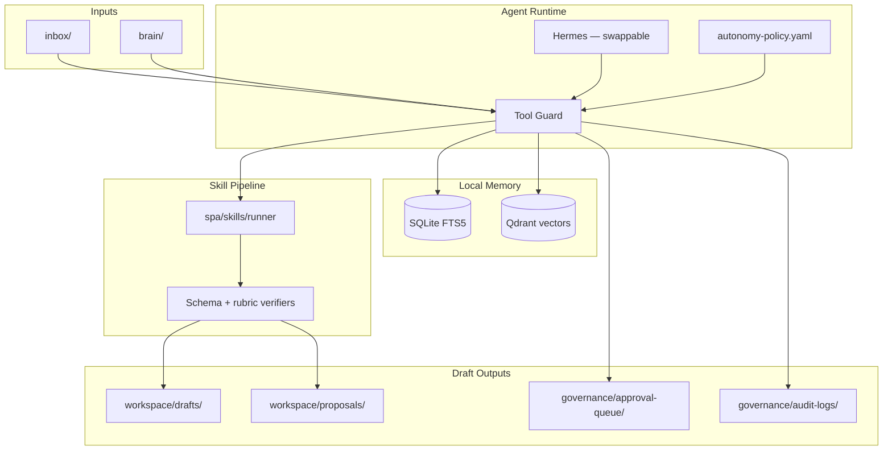

<div align="center">

# Personal GRC Agent

**Your local-first copilot for security & compliance work.**

Turn meeting notes, policy changes, and audit artifacts into verified drafts —  
without auto-publishing anything to external systems.

<br />

[](LICENSE)
[](pyproject.toml)
[](agent/charter.md)
[](agent/autonomy-policy.yaml)

<br />

[Quick Start](#-quick-start) · [Features](#-features) · [Skills](#-skills) · [Architecture](#-architecture) · [Docs](#-documentation)

</div>

---

## ✨ At a glance

| | |
|---|---|
| 🧠 **Security Brain** | Git-backed knowledge base — frameworks, policies, controls, evidence |
| ⚡ **Verifier-gated skills** | Meeting synth, tickets, policy redlines, crosswalks, evidence packs |
| 🔒 **Local-first memory** | SQLite episodic + Qdrant semantic search — nothing leaves your machine |
| 🛡️ **Governance-as-code** | Every action classified A0–A5; high-risk ops need human approval (CPO) |
| 📜 **Hash-chained audit trail** | Tamper-evident JSONL logs with CLI verify & export |

> **PGA** = the product · **`spa`** = the CLI (`pip install -e .` → `spa` on your PATH)  
> MVP mode is **file-only** — drafts and AI-Proposed tickets locally; vendor connectors ship as disabled stubs.

---

## 🚀 Quick start

```bash
git clone https://github.com/wcbot0/Personal-GRC-Agent.git
cd Personal-GRC-Agent
./bootstrap.sh
```

```bash
source .venv/bin/activate
make selftest                    # health checks
spa ingest inbox/my-notes.md     # drop notes → drafts + memory
spa proposals list               # pending approvals (may be empty)
spa audit verify                 # hash chain integrity
```

<details>
<summary><strong>macOS write-access check</strong> (if bootstrap fails with <code>Operation not permitted</code>)</summary>

```bash
echo test > governance/audit-logs/_t.tmp && rm governance/audit-logs/_t.tmp
```

Grant **Full Disk Access** to your terminal and Cursor, then clear quarantine on fresh clones:

```bash
xattr -dr com.apple.quarantine .
```

</details>

<details>
<summary><strong>spa-only setup</strong> (skip Hermes prompts)</summary>

```bash
HERMES_BOOTSTRAP=0 ./bootstrap.sh
```

</details>

---

## 🎯 Features

<table>
<tr>
<td width="50%" valign="top">

### Draft-by-default
Reads and local drafts run autonomously. Assigning humans, publishing policies, or writing to GRC/ticket systems **requires an approved Change Proposal Object (CPO)**.

### Enforcement, not convention
All writes route through `ToolGuard` + `guarded_write()`. Verifier failures block artifact output. Unknown tools default to **A5 (blocked)**.

</td>
<td width="50%" valign="top">

### Redaction-at-write
Secrets and PII are stripped before persistence via `governance/redaction-rules.yaml`. Ingest passes redacted content to downstream skills.

### Runtime-swappable
Default agent runtime is **Hermes** (MCP). Swap via `agent/runtime.config.yaml` without changing skills or brain content.

</td>
</tr>
</table>

---

## 🧩 Skills

Six MVP skills — each passes schema + rubric verifiers before writing artifacts.

| Skill | What it does | Command |
|-------|--------------|---------|
| **meeting-synth** | Notes → decisions, risks, action items, ticket proposals | `spa run-skill meeting-synth --input <file>` |
| **ticket-draft** | Control gap → AI-Proposed ticket JSON (`assignee: unassigned`) | `spa run-skill ticket-draft --input <file>` |
| **policy-redline** | Change request → redline Markdown + draft PR body | `spa run-skill policy-redline --input <file>` |
| **csf-crosswalk** | Artifact → CSF / SOC 2 / 800-53 mapping + gaps | `spa run-skill csf-crosswalk --input <file>` |
| **daily-brief** | Program status → morning triage brief | `spa run-skill daily-brief --input <file>` |
| **evidence-pack** | Control + period → evidence index in `brain/evidence/` | `spa run-skill evidence-pack --input <file> --output-dir .` |
| **risk-analyst** | Product/tool assessment → threat model, FAIR + NIST 800-30 risk register | `spa run-skill risk-analyst --input <file>` |

**Fastest path:** drop raw notes in `inbox/`, then `spa ingest inbox/<file>.md` — auto-detects meetings, runs synth, creates tickets, and triggers policy redlines when relevant.

Fixtures for every skill live in [`evals/fixtures/`](evals/fixtures/).

---

## 🏗 Architecture



### Request lifecycle

```
Input → Redaction → Policy check (A0–A5) → Guarded execution → Skill → Verification → Audit → Human review
```

| Layer | Tech | Purpose |
|-------|------|---------|
| **Episodic** | SQLite + FTS5 | Keyword search over ingested docs |
| **Semantic** | Qdrant + local embeddings | Vector search over `brain/` |
| **Procedural** | `skills/` | Versioned skill defs, schemas, verifiers |
| **Audit** | Hash-chained JSONL | Immutable, verifiable action log |

### Action-risk model

| Class | Label | Approval | Examples |
|:-----:|-------|----------|----------|
| **A0** | read | none | read inbox, search memory, ingest |
| **A1** | local_draft | none | workspace drafts, git branches |
| **A2** | external_draft | notify | AI-Proposed tickets, draft PR bodies |
| **A3** | human_workflow | **CPO** | assign human, raise priority |
| **A4** | authoritative_record | **CPO** | merge PR, publish policy, GRC write |
| **A5** | high_risk | **blocked** | delete audit logs, unknown tools |

---

## 👥 Who is it for?

| Role | Typical use |
|------|-------------|
| **Staff Security / GRC engineer** | Steering meetings → tracked action items and control-tagged tickets |
| **Compliance lead** | Evidence packs, framework crosswalks, policy redlines |
| **Security program manager** | Daily briefs on pending approvals and open proposals |
| **Teams adopting PGA** | Fork the template, populate `brain/`, wire connectors post-MVP |

---

## 📚 Documentation

<details open>
<summary><strong>Setup guide</strong></summary>

### Prerequisites

| Requirement | Notes |
|-------------|-------|
| **Python 3.11+** | Required |
| **Docker Desktop** | Qdrant (`:6333`) + optional embedding service (`:8080`) |
| **Git** | Bootstrap and policy-redline branches |
| **macOS / Linux** | Tested on macOS |

Optional: **Hermes Agent** (MCP chat runtime) · **LLM API key** (for full Hermes sessions)

### Bootstrap

`./bootstrap.sh` is **idempotent** — creates venv, installs `spa`, copies `.env`, starts Docker, seeds `brain/` into Qdrant, runs `make selftest`, and optionally wires Hermes.

| Variable | Behavior |
|----------|----------|
| `HERMES_BOOTSTRAP=0` | spa-only — skip Hermes |
| `HERMES_BOOTSTRAP=1` | Auto-install + wire Hermes |
| `CI=true` | Skip Hermes |

If Docker wasn't running during bootstrap:

```bash
docker compose up -d && make seed
```

### Troubleshooting

| Symptom | Fix |
|---------|-----|
| `pip: command not found` after activate | Repo moved — run `./bootstrap.sh` or `rm -rf .venv && ./bootstrap.sh` |
| Docker daemon not running | Start Docker Desktop → `docker compose up -d && make seed` |
| Qdrant seed warnings | Wait for healthy containers → `make seed` |
| macOS `Operation not permitted` | See write-access check in Quick Start |

</details>

<details>
<summary><strong>Integrating with Hermes Agent</strong></summary>

PGA works in two modes — use either or both:

| Mode | When to use |
|------|-------------|
| **`spa` CLI** | Batch drafting, CI, anything that must be auditable |
| **Hermes Agent** | Conversational access to your Security Brain via MCP |

### Manual Hermes setup

```bash
# 1. Install Hermes (if bootstrap didn't)
curl -fsSL https://hermes-agent.nousresearch.com/install.sh | bash

# 2. Wire MCP filesystem to this repo
./scripts/setup-hermes.sh

# 3. Configure model
hermes model

# 4. Chat from repo root (loads AGENTS.md)
hermes chat
```

Hermes MCP mounts: `brain/`, `inbox/`, `workspace/drafts/`

For governed artifacts (verifiers + audit trail), run `spa` skills — Hermes reads and drafts via MCP but doesn't enforce ToolGuard.

```bash
spa ingest inbox/my-meeting-notes.md
spa run-skill meeting-synth --input evals/fixtures/meeting_sample.md
```

| Symptom | Fix |
|---------|-----|
| `hermes: command not found` | Reload shell or `./scripts/install.sh --interactive` |
| MCP won't connect | `hermes mcp test pga-filesystem`; check `npx` / Node |
| Chat ignores PGA rules | Start `hermes chat` from repo root |
| API key errors | Keys live in `~/.hermes/.env`, not PGA's `.env` |

</details>

<details>
<summary><strong>Configuration</strong></summary>

Copy `.env.example` → `.env` (bootstrap does this automatically). **Never commit `.env`.**

| Variable | Default | Purpose |
|----------|---------|---------|
| `SPA_DATA_DIR` | `workspace/.data` | SQLite, drafts, proposals override |
| `SPA_AUDIT_DIR` | `governance/audit-logs` | Audit log directory |
| `LLM_PROVIDER` | `openai` | LLM backend |
| `LLM_API_KEY` | _(empty)_ | Your API key |
| `LLM_MODEL` | `gpt-4o-mini` | Model for sessions |
| `QDRANT_HOST` | `localhost` | Vector DB host |
| `QDRANT_PORT` | `6333` | Vector DB port |
| `TICKET_PROVIDER` | `none` | `none`, `linear`, `jira` |
| `GRC_PROVIDER` | `none` | `none`, `vanta`, `drata`, `secureframe` |

On Apple Silicon, embeddings run locally via `sentence-transformers` (no arm64 Docker image for TEI).

Key config files: `agent/charter.md` · `agent/autonomy-policy.yaml` · `agent/runtime.config.yaml` · `governance/redaction-rules.yaml`

</details>

<details>
<summary><strong>Common workflows</strong></summary>

### Drop-and-process

```bash
spa ingest inbox/my-meeting-notes.md
# → redact → memory → meeting-synth → ticket proposals → optional policy-redline
```

### Review high-risk actions

```bash
spa proposals list
spa proposals show cpo-<uuid>
spa proposals approve cpo-<uuid>
spa proposals reject cpo-<uuid> --reason "..."
```

### Audit integrity & export

```bash
spa audit verify
spa audit verify --from 2026-01-01 --to 2026-12-31
spa evidence export --output /tmp/pga-evidence.tar.gz
```

### Populate Security Brain

```
brain/
├── 00-meta/           conventions
├── 01-frameworks/     CSF 2.0, SOC 2, ISO 27001
├── 02-controls/       control catalog
├── 03-policies/       authoritative policies
├── evidence/          evidence indexes
└── ...
```

After edits: `make seed`

</details>

<details>
<summary><strong>Governance & approvals</strong></summary>

A3+ actions create a **Change Proposal Object** in `governance/approval-queue/` and block until approved:

```json
{
  "id": "cpo-<uuid>",
  "status": "pending",
  "action_class": "A3",
  "action_type": "assign_human",
  "title": "Assign ticket to Alice",
  "control_tags": ["CC6.1"]
}
```

| Mechanism | Behavior |
|-----------|----------|
| **ToolGuard** | Classifies every tool call; blocks A5 |
| **guarded_write()** | Central entry for memory, artifacts, connectors |
| **Verifier gate** | Second failure → CPO + blocks artifact write |
| **Hash-chained audit** | SHA-256 linked events in `governance/audit-logs/` |

Redteam corpus (30 cases): `make redteam` or `./scripts/redteam.sh`

Retention policy: `governance/retention-policy.yaml` · Backups: `scripts/backup.sh`

</details>

<details>
<summary><strong>Repository layout</strong></summary>

| Path | Purpose |
|------|---------|
| `agent/` | Charter, identity, autonomy policy, runtime config |
| `brain/` | Git-backed Security Brain |
| `skills/` | Skill contracts, schemas, verifiers |
| `spa/` | CLI, memory, governance, skill runner, audit chain |
| `connectors/` | Ticket/GRC/notes interfaces (stubs in MVP) |
| `governance/` | Redaction, audit logs, approval queue, retention |
| `evals/` | Golden fixtures and eval harness |
| `inbox/` | Drop zone for ingest |
| `workspace/` | Drafts and proposals |
| `tests/` | Unit and integration tests |

Agent navigation for Cursor / Claude Code / Hermes: [`AGENTS.md`](AGENTS.md)

</details>

<details>
<summary><strong>Development & testing</strong></summary>

```bash
make help            # all targets
make selftest        # health checks
make eval            # golden-fixture skill evals
make redteam         # prompt-injection corpus
make lint            # policy-lint + secret-scan
pytest tests/ -v     # 40+ tests
```

Scaffold a new skill:

```bash
./scripts/new-skill.sh my-new-skill
# → implement spa/skills/my_new_skill.py
# → register in spa/skills/runner.py
# → add tool mappings to agent/autonomy-policy.yaml
```

</details>

<details>
<summary><strong>Forking for your organization</strong></summary>

1. **Use as template** — GitHub "Use this template" or mirror to your org
2. **Private fork** — add org policies, real `brain/` content, `.env` secrets
3. **Update CODEOWNERS** — replace placeholder handles
4. **Enable connectors post-MVP** — set env vars, enable `live_writes`, wire `mcp/*.json.disabled`
5. **Strip before public sharing** — remove private brain, audit logs, workspace state

</details>

<details>
<summary><strong>CI & quality gates</strong></summary>

| Workflow | Purpose |
|----------|---------|
| `policy-lint` | Validates autonomy-policy + JSON schemas |
| `skill-tests` | pytest, golden evals, audit hash chain verify |
| `secret-scan` | Scans for committed secrets |
| `redteam` | 30-case prompt-injection corpus |

</details>

---

<div align="center">

<br />

**Clone → bootstrap → run.** MIT-licensed public template — fork into a private org repo for your Security Brain.

<br />

[](LICENSE)
[](AGENTS.md)
[](.github/ISSUE_TEMPLATE/bug_report.md)

</div>
